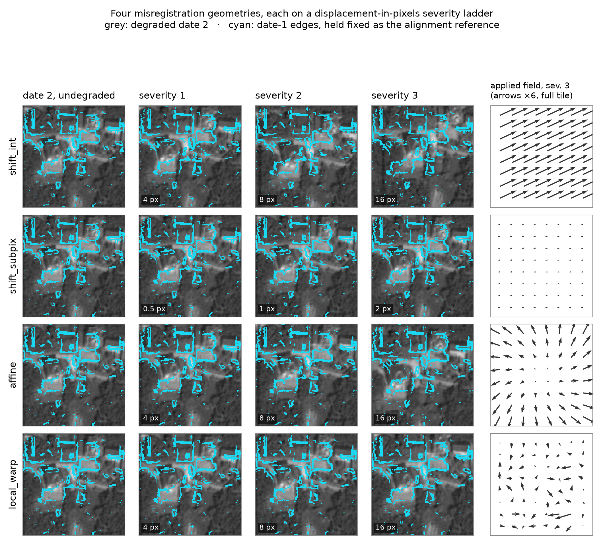
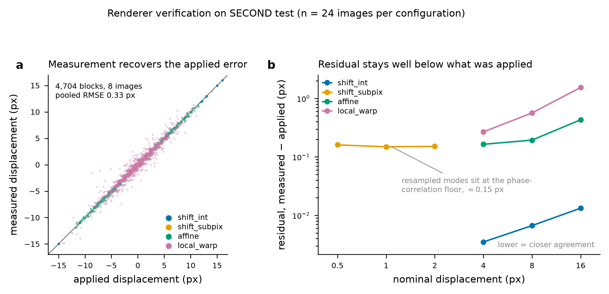

# Misregistration degradation family

First degradation family of the change-detection robustness benchmark. Models a
*relative geometric error between the two dates* of a delivered bi-temporal
product: orthorectification residuals, DEM error, platform attitude error and
independent per-date co-registration.

Dependencies: `numpy`, `scipy`, `pillow`. No OpenCV, no scikit-image, no torch
in the core — all three are in the Alliance wheelhouse, so `pip --no-index`
installs cleanly on Narval.

```
robustcd/
  degradations/
    misregistration.py   # spec, seeding, warp sampling, warp application
    measure.py           # phase-correlation displacement measurement
    wrappers.py          # MisregTransform (on-the-fly) + RenderedSet (offline)
  datasets/
    second.py            # SECOND-style reader; directory or .zip
scripts/
  render_misregistration.py    # offline renderer CLI
  validate_misregistration.py  # applied-vs-measured verification -> CSV
```

## The grid: 4 modes × 3 severities

| mode | error shape | severity 1 / 2 / 3 (px) |
|---|---|---|
| `shift_int` | integer global translation, applied by array indexing — **no interpolation** | 4 / 8 / 16 |
| `shift_subpix` | fractional global translation, cubic resampling | 0.5 / 1 / 2 |
| `affine` | rotation + scale residual about the tile centre; displacement grows with radius | 4 / 8 / 16 |
| `local_warp` | smooth non-rigid field from a 6×6 random control grid, cubic-upsampled | 4 / 8 / 16 |

Severity is **displacement in pixels** in every mode, so degradation curves from
different modes share an x-axis. For `affine` the budget is split between a
rotation and a scale residual; because the rotational displacement is tangential
and the scale displacement radial, the two are orthogonal and the split is
`(f, sqrt(1 - f²))` with `f ~ U(0.3, 0.7)` — this lands the maximum corner
displacement exactly on the nominal level (verified: 3.99 / 8.01 / 15.91 px).

`shift_int` exists as the control that separates *sensitivity to displacement*
from *sensitivity to resampling*: it is the only mode that moves pixels without
filtering them. If a model degrades under `shift_subpix` at 2 px but not under
`shift_int` at 4 px, the mechanism is blur, not misalignment.

The ladders live in `SEVERITY_PX` at the top of `misregistration.py`. Every
rendered set records the value it used in its manifest, so re-laddering does not
silently invalidate earlier results.



*Rows: the four modes. Columns 1–4: a 128 px crop of date 2, undegraded and at
the three severities, with date-1 edges drawn in cyan as a fixed alignment
reference — grey structure drifting out from under the cyan outline is the
injected error. Column 5: the applied displacement field over the whole 512 px
tile at severity 3, arrows ×6, one shared scale across rows.*

## Ground-truth convention

Default `apply_to="t2"`: **date 1 is the geometric reference, only date 2 is
warped, and the labels are not touched.** The degradation represents an error in
the *product*, so the correct answer is unchanged and the metric drop measures
robustness. Warping the labels along with date 2 asks a different question —
how a model behaves given consistent but displaced evidence — and is available
as `warp_labels=True` for an ablation, not as the default.

`apply_to="split"` distributes the error symmetrically (t1 by −d/2, t2 by +d/2)
for products where neither date is the reference. The half-transforms are exact
fractional matrix powers, so composing them reproduces the full error; note that
this resamples *both* dates, so `shift_int` is no longer interpolation-free
under `split`.

**Border strip.** A displaced date necessarily vacates a strip at the image
border where there is no true observation: 0.4–8.5 % of pixels across this grid
(`reflect` padding fills it with plausible texture rather than an artificial
black edge). Every rendered sample carries a `valid_mask` PNG, so evaluation can
report interior-only metrics or full-tile metrics without re-rendering — worth
deciding once and stating in the paper, since edge pixels are where the
strongest false-change signal sits.

## Determinism

Transform parameters come from
`blake2b(dataset | sample_id | family | mode | severity | global_seed)` seeding a
`numpy.random.Generator`. Consequences worth relying on:

- rendering on the Arch box and evaluating on Narval give the same degradation;
- shuffling, worker count and epoch order cannot change what a sample receives
  in the on-the-fly path;
- adding a mode or a severity does not perturb the others;
- `--overwrite`-free re-runs are idempotent (verified: second pass skips all).

## Usage

Offline render (what the paper numbers should use — every model sees identical
bytes):

```bash
python scripts/render_misregistration.py \
    --source /path/to/SECOND_total_test.zip \
    --out    /scratch/$USER/robustcd/degraded \
    --dataset SECOND --split test --jobs 8
```

Output per configuration: `misreg-<mode>-s<k>/{im2,valid_mask}/<id>.png`,
`manifest.jsonl` (one record per sample: seed inputs, realized transform matrix
or field statistics, realized displacement, valid fraction) and
`dataset_spec.json`. Streams the degradation does not touch are **not**
duplicated — `dataset_spec.json` points at the source root for them, so the
12-point grid costs ~1/4 of the naive footprint (~0.8 GB per configuration for
SECOND test at 1694 tiles). `--materialize-all` writes self-contained
directories instead; `RenderedSet` requires either that flag or an extracted
(non-zip) source, since it resolves pass-through streams by path.

Reading a rendered set:

```python
from robustcd.degradations.wrappers import RenderedSet
rs = RenderedSet("/scratch/$USER/robustcd/degraded/SECOND/test/misreg-local_warp-s2")
s = rs[0]        # {'sample_id', 'im1', 'im2', 'label1', 'label2', 'valid_mask'}
rs.manifest[s["sample_id"]]["warp_params"]
```

On-the-fly, for quick experiments:

```python
from robustcd.degradations.misregistration import MisregSpec
from robustcd.degradations.wrappers import MisregTransform
tf = MisregTransform(MisregSpec(mode="affine", severity=2), dataset="SECOND")
sample = tf(sample, sample_id)   # numpy in, numpy out; normalisation stays in your repo
```

Both paths return numpy arrays in the dataset's native dtype — no normalisation,
no tensor conversion — so the same module drops into ten model repos without
fighting their transforms. `TorchRenderedSet` wraps `RenderedSet` as a
`torch.utils.data.Dataset`; `torch` is imported lazily and only there.

### Narval

```bash
module load python/3.11 scipy-stack
virtualenv --no-download $SLURM_TMPDIR/env && source $SLURM_TMPDIR/env/bin/activate
pip install --no-index --upgrade pip
pip install --no-index numpy scipy pillow
python scripts/render_misregistration.py --source $SCRATCH/data/SECOND/test \
    --out $SCRATCH/robustcd/degraded --jobs $SLURM_CPUS_PER_TASK
```

Rendering is CPU-only and embarrassingly parallel — a CPU allocation is enough;
it does not belong in a GPU job.

## Verification

`scripts/validate_misregistration.py` measures the applied warp back off the
rendered pixels by normalised phase correlation (whole-image, and block-wise on
96 px blocks at 64 px stride) and compares it against the analytic displacement
field. Result on 24 SECOND test images × 12 configurations (288 checks,
[`results/misregistration_validation.csv`](../results/misregistration_validation.csv)):



| mode | severity | nominal (px) | analytic peak (px) | block residual RMSE (px) |
|---|---|---|---|---|
| `shift_int` | 1 / 2 / 3 | 4 / 8 / 16 | 4.08 / 8.00 / 16.05 | 0.004 / 0.007 / 0.013 |
| `shift_subpix` | 1 / 2 / 3 | 0.5 / 1 / 2 | 0.50 / 1.00 / 2.00 | 0.161 / 0.149 / 0.151 |
| `affine` | 1 / 2 / 3 | 4 / 8 / 16 | 3.99 / 8.01 / 15.91 | 0.165 / 0.194 / 0.432 |
| `local_warp` | 1 / 2 / 3 | 4 / 8 / 16 | 4.00 / 8.00 / 16.00 | 0.268 / 0.566 / 1.542 |

Reading this honestly: integer shifts are recovered essentially exactly
(≤0.013 px), which is the only mode where the measurement has no confound. The
~0.15 px floor on the resampled modes is the phase-correlation estimator, not
the renderer — cubic resampling filters the image content the estimator relies
on. The larger `local_warp` residual is block averaging: a 96 px block spans a
non-constant displacement, and the residual grows with the field's spatial
gradient exactly as expected. Per-block agreement is ≥0.97 (Pearson) in every
mode at the 5th percentile; 3 of 288 checks fall below 0.9, all `shift_subpix`
at 0.5–1 px where the applied displacement is comparable to the estimator noise
while the residual stays at ~0.23 px.

Not assessed: effect on model metrics (that is the benchmark itself), and
cross-dataset behaviour on Hi-UCD and LEVIR-CD — `SecondLike` expects
`im1/im2/label1/label2`, so LEVIR-CD needs its `A/B/label` directories renamed
or the stream names remapped.
